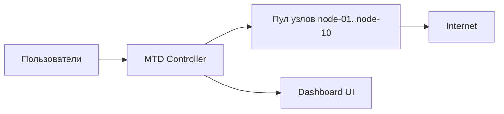

# Локальный демо-проект сетевого MTD (научный прототип)

Локальный научный прототип, демонстрирующий концепцию **Moving Target Defense (MTD) на сетевом уровне**: периодическую ротацию входных узлов, случайный выбор relay-узлов и автоматическое исключение скомпрометированных узлов из маршрутов.

## 1. Цель проекта

Показать, как динамическая перестройка маршрутов пользователя в сети уменьшает предсказуемость инфраструктуры и сокращает «окно атаки» для злоумышленника.

## 2. Исследовательская постановка

### 2.1 Проблема
Статическая сетевая топология и устойчивые маршруты упрощают разведку и закрепление атакующего.

### 2.2 Исследовательский вопрос
Снижает ли периодическая мутация маршрутов (ротация entry + случайный relay + исключение compromised-узлов) устойчивость атаки в модели «пользователь -> сеть/интернет»?

### 2.3 Гипотеза
Если маршруты пользователей регулярно меняются, а подозрительные узлы моментально исключаются из пула, то ценность разведданных злоумышленника падает, а продолжительность успешной компрометации уменьшается.

### 2.4 Переменные
- Независимые:
  - интервал ротации входного узла;
  - состояние узлов (`healthy`, `compromised`, `unreachable`);
  - число пользователей.
- Зависимые:
  - число перестроений маршрутов;
  - стабильность активных маршрутов;
  - скорость восстановления маршрутов после компрометации.

### 2.5 Перколяция (в контексте проекта)
В рамках проекта перколяция рассматривается как распространение риска компрометации по графу маршрутов (`user -> entry -> relay`). Логика MTD используется как механизм разрыва перколяционных цепочек: при смене маршрута и исключении compromised-узлов непрерывные пути распространения риска размыкаются.

### 2.6 Теоретическая модель проблемы
Классическая проблема сетевой защиты в такой постановке — асимметрия времени:
- атакующий может долго вести разведку статичного маршрута;
- защитник обычно реагирует уже после обнаружения инцидента.

В статичной схеме у атакующего накапливается знание о топологии и растет вероятность успешной атаки по мере времени наблюдения. В терминах графа это означает формирование устойчивых путей распространения риска между пользователями и узлами доступа.

Для проекта используем абстрактный ориентированный граф:
- вершины: пользователи, MTD-узлы, интернет-узел;
- ребра: активные маршруты `user -> entry -> relay -> internet`;
- состояние узлов: `healthy`, `compromised`, `unreachable`.

Риск компрометации трактуется как процесс перколяции по активным ребрам: если в графе долго сохраняются непрерывные цепочки через одни и те же узлы, вероятность устойчивого распространения риска возрастает.

### 2.7 Как проект решает эту проблему
Проект использует проактивную стратегию MTD, которая снижает эффект асимметрии не только обнаружением, но и постоянным изменением среды:
1. Ротация `entry` уменьшает время жизни маршрута и обнуляет часть разведданных.
2. Случайный выбор `relay` увеличивает неопределенность следующего шага маршрута.
3. Исключение compromised-узла удаляет зараженную вершину из рабочего графа.
4. Автоматический reroute разрывает уже сформированные цепочки в момент инцидента.

Тем самым решается не только задача «обнаружить атаку», но и задача «ограничить распространение» за счет управляемой перестройки графа доступа.

### 2.8 Операционализация гипотезы
Гипотеза проверяется через наблюдаемые показатели системы:
- чем выше частота управляемых ротаций, тем ниже стабильность фиксированных маршрутов;
- чем быстрее reroute после `compromised`, тем короче потенциальная перколяционная цепь;
- чем меньше доля маршрутов, проходящих через проблемные узлы, тем ниже риск устойчивой перколяции.

В прототипе это фиксируется через счетчики `total_rotations`, `total_reroutes`, `active_routes`, а также через событийный таймлайн, который дает причинно-следственную интерпретацию изменений.

## 3. Что входит в MVP

- `10` Docker-контейнеров как MTD-узлы (`node-01 ... node-10`);
- `1` контроллер MTD (FastAPI);
- веб-дашборд (граф + события + метрики в реальном времени);
- единый стартер `starter.py` для `start/stop/status/logs`.

## 4. Принцип действия проекта

Ниже описан реальный рабочий цикл системы в этой реализации.

### Шаг 1. Инициализация
1. `starter.py` запускает `docker compose up`.
2. Поднимаются 10 node-контейнеров и 1 controller.
3. Контроллер создает стартовые маршруты для пользователей (`DEFAULT_USERS`).

### Шаг 2. Назначение входного узла (entry)
1. Для каждого пользователя выбирается текущий `entry_node`.
2. Этот узел является первой точкой входа пользователя в схему маршрутизации.

### Шаг 3. Выбор промежуточного/выходного узла (relay)
1. При подключении пользователя контроллер выбирает случайный `relay_node` из пула **только healthy-узлов**.
2. `relay_node` не совпадает с `entry_node`.
3. Получается маршрут вида:
   `user -> entry -> relay -> internet`.

### Шаг 4. Периодическая ротация
1. По таймеру (`ROTATION_INTERVAL_SECONDS`) контроллер ротирует `entry_node` у пользователей.
2. После смены entry пересобирается relay.
3. В демо по умолчанию интервал `60` секунд (для наглядности), в «реалистичном» режиме можно ставить `600` секунд (10 минут).

### Шаг 5. Мониторинг состояния узлов
1. Контроллер периодически опрашивает все node-сервисы (`/health`).
2. Статусы синхронизируются в одно из состояний:
   - `healthy`;
   - `compromised`;
   - `unreachable`.

### Шаг 6. Исключение скомпрометированного узла
1. Если узел помечен `compromised`, он исключается из пула доступных узлов.
2. Если этот узел участвовал в активных маршрутах (как entry или relay), маршруты пользователей автоматически перестраиваются.
3. События фиксируются в таймлайне (`node_status_changed`, `route_rerouted`, `entry_rotated`, `user_connected`).
4. С точки зрения перколяции это реализует контролируемый разрыв потенциальной «цепи заражения» в графе доступа.

### Шаг 7. Визуализация и наблюдаемость
1. UI получает состояние через `WebSocket /ws`.
2. Граф, список нод, таймлайн и метрики обновляются в реальном времени.
3. Это позволяет демонстрировать причинно-следственную цепочку изменений «вживую».

## 5. Архитектура



## 6. Компоненты

- `controller/`
  - FastAPI-приложение;
  - движок MTD-логики;
  - REST API + WebSocket;
  - статика дашборда.
- `node_service/`
  - сервис отдельного узла;
  - API состояния: `health/compromise/recover`.
- `starter.py`
  - единая точка запуска и управления стеком.

## 7. Визуализация в UI

Дашборд использует связку: **сетевой граф + таймлайн событий + карточки метрик**.

Почему так:
- граф показывает динамику топологии моментально;
- таймлайн объясняет, почему маршрут изменился;
- метрики дают численное подтверждение поведения системы.

Смысл элементов:
- пользователи: синие прямоугольные узлы;
- MTD-ноды: цвет по статусу;
- Internet: ромб;
- ребра:
  - `user -> entry` (синий);
  - `entry -> relay` (зеленый);
  - `relay -> internet` (оранжевый, пунктир).

Статусы нод:
- `healthy` — зеленый;
- `compromised` — красный;
- `unreachable` — серый;
- активный `entry` — синяя обводка;
- активный `relay` — оранжевый ореол.

## 8. Доступные метрики

- `total_nodes`
- `healthy_nodes`
- `compromised_nodes`
- `unreachable_nodes`
- `total_users`
- `active_routes`
- `total_rotations`
- `total_connections`
- `total_reroutes`
- `uptime_seconds`

Дополнительно в интерпретации результатов используется перколяционный взгляд: чем чаще и быстрее система разрывает маршруты, затронутые compromised-узлами, тем ниже вероятность устойчивой перколяции риска через сеть.

## 9. Запуск

### 9.1 Требования
- Docker + Docker Compose;
- Python 3.10+ (для `starter.py`).

### 9.2 Старт
```bash
python starter.py start
```

Альтернатива:
```bash
./scripts/start.sh
```

Дашборд:
- [http://localhost:8000](http://localhost:8000)

### 9.3 Остановка
```bash
python starter.py stop
```

### 9.4 Статус
```bash
python starter.py status
```

### 9.5 Логи контроллера
```bash
python starter.py logs
```

## 10. Сценарий демо для защиты

1. Запустить стек: `python starter.py start`.
2. Показать стартовый граф с маршрутами пользователей.
3. Нажать `Force Rotation` и показать смену `entry`/`relay`.
4. Кликнуть по healthy-ноде в списке и пометить ее `compromised`.
5. Показать авто-перестроение маршрутов и события в таймлайне.
6. Восстановить ноду (`recover`) и показать стабилизацию пула.
7. Добавить пользователя и принудительно выполнить `connect`.

## 11. API (кратко)

- `GET /api/state` — полный снимок состояния.
- `POST /api/rotate` — ручная ротация entry.
- `POST /api/probe` — ручной health probe.
- `POST /api/users` — добавить пользователя (`{"user_id":"user-x"}`).
- `POST /api/users/{user_id}/connect` — обновить relay пользователя.
- `POST /api/nodes/{node_id}/compromise` — пометить ноду compromised.
- `POST /api/nodes/{node_id}/recover` — вернуть ноду в healthy.
- `WS /ws` — потоковое обновление состояния.

## 12. Настройки окружения

В `docker-compose.yml` для контроллера:
- `ROTATION_INTERVAL_SECONDS` (по умолчанию `60`);
- `TRAFFIC_INTERVAL_SECONDS` (по умолчанию `6`);
- `HEALTHCHECK_INTERVAL_SECONDS` (по умолчанию `5`);
- `DEFAULT_USERS` (по умолчанию `user-01,user-02,user-03,user-04`);
- `EVENT_BUFFER_SIZE` (по умолчанию `300`).

Для режима, близкого к постановке «каждые 10 минут», установите:
- `ROTATION_INTERVAL_SECONDS=600`.
